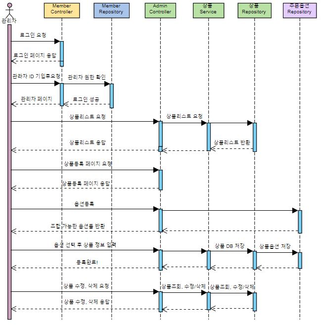
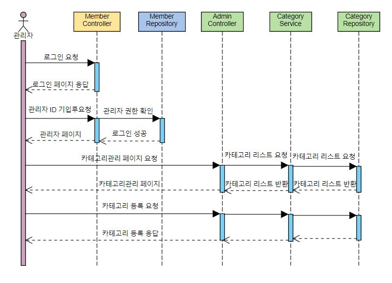
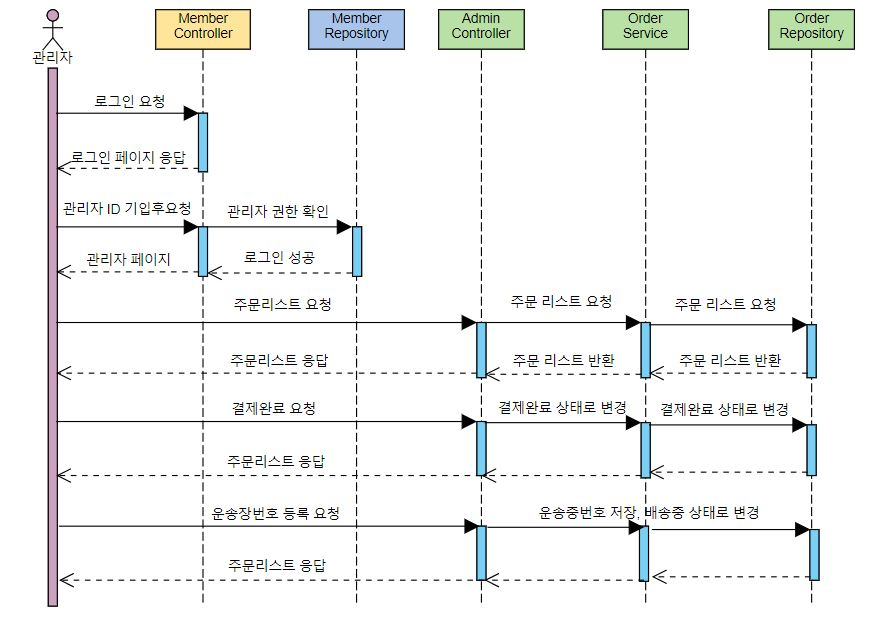
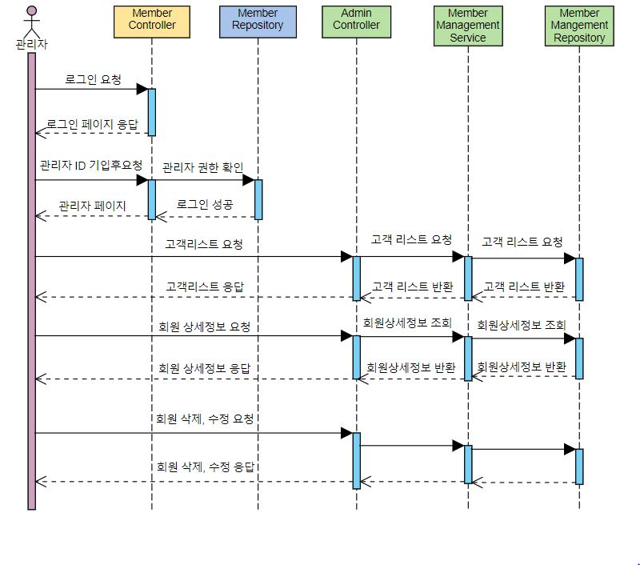
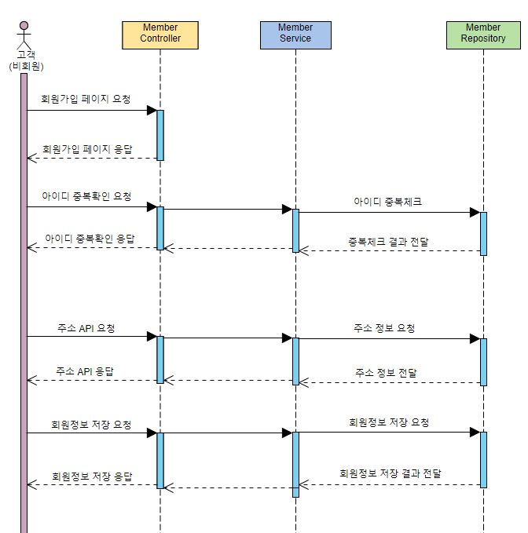
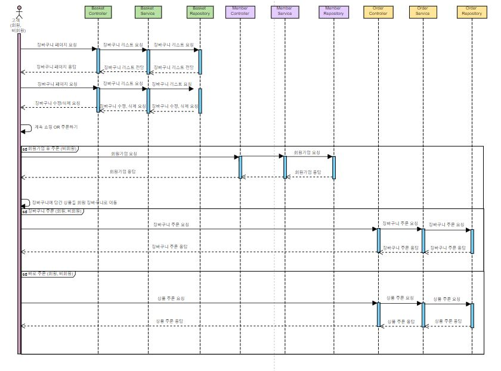
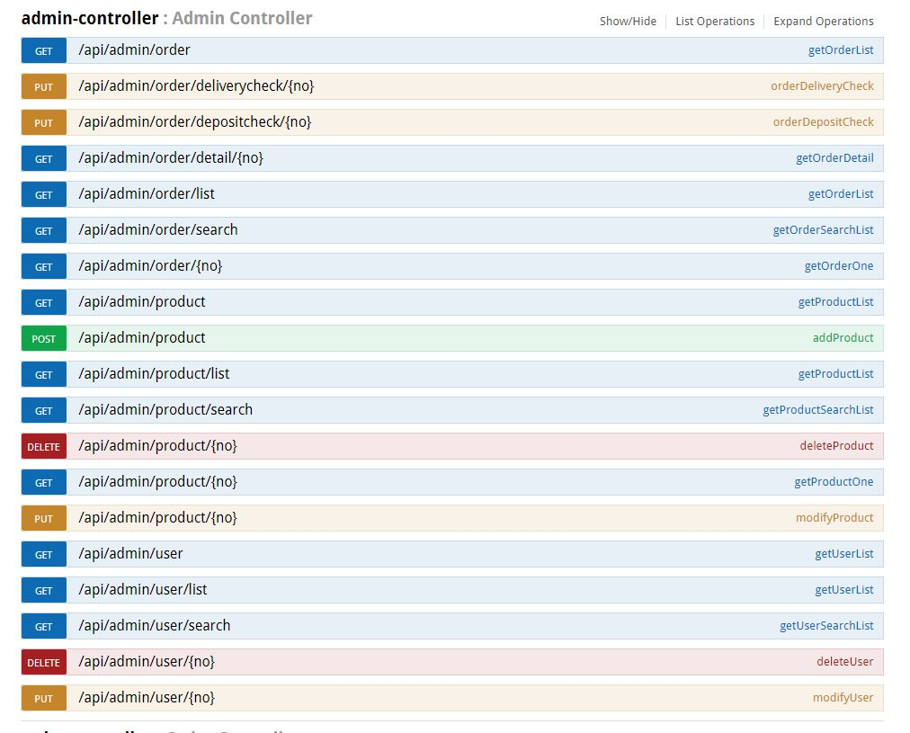
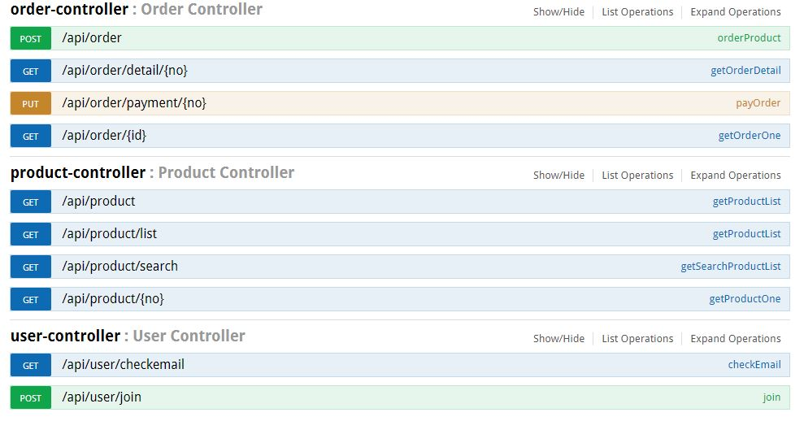

# 프로젝트 설계도 🗺

## 시퀀스

### 관리자 - 상품관리


### 관리자 - 카테고리관리


### 관리자 - 주문관리


### 관리자 - 고객관리


### 비회원 - 회원가입


### 고객 - 장바구니&주문&결제


## src/main/java 설정 🚩

### Controller

- MainController	- index
- UserController	- 회원가입, 로그인, 마이페이지, 로그아웃, 장바구니 담기, 삭제
- AdminController	- 상품관리, 재고관리, 고객관리, 주문관리
- ProductController	- 상품검색, 상품목록조회, 상품상세조회
- OrderController	- 상품주문, 주문내역확인, 주문상세보기, 주문결제

<br>

### Service

- UserService
- AdminService
- ProductService
- OrderService

<br>

### Repository

- UserDao
- AdminDao
- ProductDao
- OrderDao

<br>

### Vo

- UserVo
- AddressVo
- CartVo

- CategoryVo
- ProductVo
- RepresentativeImageVo

- OptionVo
- OptionNameVo
- OrderOptionVo

- OrderVo
- OrderDetailVo


## src/test/java 설정 🚩

### config

- TestAppConfig
- TestWebConfig
- TestMVCConfig

### controller.api

- AdminControllerTest
- UserControllerTest
- ProductControllerTest
- OrderControllerTest

### service

- AdminServiceTest
- UserServiceTest
- ProductServiceTest
- OrderServiceTest

### repository

- 추후에 고려

### Scenario

- NotUserJoinScenarioTest
- UserCartOrderPayScenarioTest


<hr>

## API & TEST 정리 ✅


### AdminController

### 상품관리

#### 상품리스트 요청

```
GET - /api/admin/product/list
GET - /api/admin/product
```

`가져올 데이터 목록`

- 상품이름
- 상품가격
- 상품등록일
- 상품진열여부
- 상품옵션여부
- 상품진열순위
- 상품디테일
- 상품배송비
- 상품카테고리번호 ===> 상품카테고리명, 깊이, 부모칼럼, 그룹넘버


`==> 상품 각 옵션별 정보들 ( 옵션별 수량, 옵션별 가격)`


#### 상품등록

```
POST - /api/admin/product
```

`전송할 데이터 목록`

- 상품명
- 판매가
- 진열여부
- 판매상태
- 상품분류 ---> 카테고리
javascript로
- 상품옵션여부 ---> 사용함 체크?    
- 옵션명 옵션값
- 옵션별
- 조합가능한 옵션 뿌려주기
- 배송비

`위의 모든 정보들을 전송`

`====> 써야할 테이블`
상품, 옵션, 옵션이름,상품옵션, 카테고리

#### 상품수정

```
PUT - /api/admin/product/{no}
```

#### 상품삭제

```
DELETE - /api/admin/product/{no}
```

#### 상품검색

```
GET - /api/admin/product/search?keyword=''
```

### 주문관리


#### 전체주문리스트 요청

```
GET - /api/admin/order/list
GET - /api/admin/order
```

`가져올 데이터 목록`

- 주문일(결제일)
- 주문번호
- 주문자
- 상품명
- 배송상태
- 배송메모
- 결제수단
- 총금액

#### 입금확인 체크

```
PUT - /api/admin/order/depositcheck/{no}
```

`클릭시 주문상태가 결제대기에서 결제완료로 변경`

#### 배송출발 체크

```
PUT - /api/admin/order/deliverycheck/{no}
```

`클릭시 배송지로 어떤 배송을 사용할 것이고 어떤택배사를 쓸것인지 결정`


#### 전체주문중에 주문상세 요청

```
GET - /api/admin/order/detail/{no}
```

`가져올 데이터 목록`

- 상품정보
- 주문상태
- 결제정보
- 배송지정보

#### 주문검색

```
/api/admin/order/search?keyword=''
```

### 회원관리

#### 회원리스트 요청

```
GET - /api/admin/user/list
GET - /api/admin/user
```

`가져올 데이터 목록`

- 이름
- 아이디
- 등록일
- 휴대폰번호
- 나이
- 지역
- 메일


#### 회원 삭제

```
DELETE - /api/admin/user/{no}
```

#### 회원 상태 수정

```
PUT - /api/admin/user/{no}
```

#### 회원검색

```
GET - /api/admin/user/search?keyword=''
```

<hr>

### UserController

#### 회원가입

```
POST - /api/user/join
```

#### 이메일 인증

```
GET - /api/user/checkemail
```

#### 로그인

```
POST - /api/user/login
```

#### 회원정보수정 (마이페이지)

```
PUT - /api/user/modify
```

#### 로그아웃

```
POST - /api/user/logout
```

#### 장바구니 리스트 요청

```
GET - /api/user/cart
```

#### 장바구니 담기 - ajax

```
POST - /api/user/cart
```

#### 장바구니 삭제 - ajax

```
DELETE - /api/user/cart
```

<hr>

### ProductController

#### 상품검색

```
GET - /api/product?keyword=''
```

#### 상품목록조회

```
GET - /api/product/list
GET - /api/product/
GET - /api/product?category=''
```

#### 상품상세조회

```
GET - /api/product/{no}
```

<hr>

### OrderController

#### 상품주문

```
POST - /api/order
```

#### 주문내역확인

```
GET - /api/order/list
GET - /api/order
```

#### 주문상세보기

```
GET - /api/order/{no}
```

#### 주문결제

```
POST - /api/order/payment
```

## Swagger API 목록



